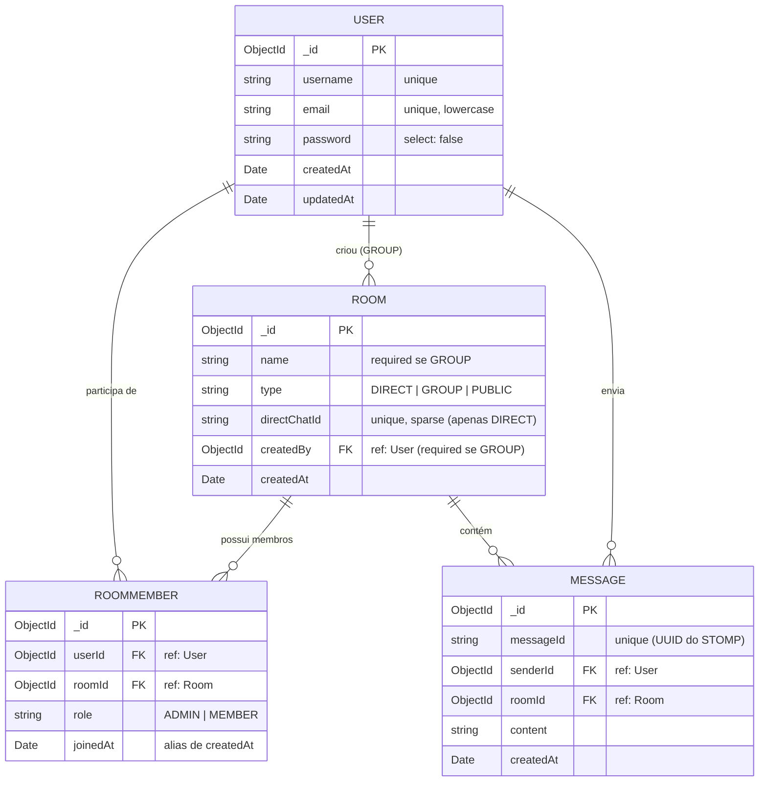
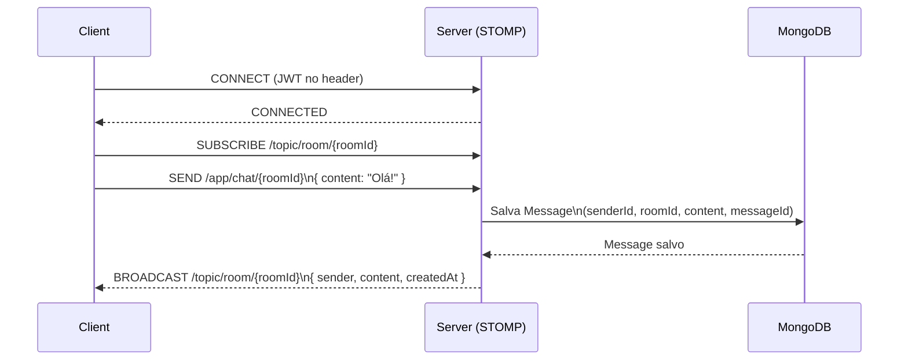

# Database — Modelo de Dados

> **Banco de dados:** MongoDB (via Mongoose)
> **Arquivo de diagrama original:** [`ChatWebSocket.drawio`](./ChatWebSocket.drawio)

---

## Visão Geral

O banco de dados é composto por **4 collections** principais que representam as entidades do chat:

| Collection    | Descrição                                                   |
|---------------|-------------------------------------------------------------|
| `users`       | Usuários cadastrados na plataforma                          |
| `rooms`       | Salas de chat (pública, grupo ou conversa direta)           |
| `roommembers` | Relacionamento N:N entre usuários e salas (com metadados)   |
| `messages`    | Mensagens enviadas dentro de uma sala                       |

As relações são expressas via **referências de ObjectId** (padrão Mongoose), refletindo a natureza de documentos do MongoDB: não há chaves estrangeiras com constraint no banco, mas a integridade é garantida pela aplicação.

---

## Diagrama Entidade-Relacionamento (ER)

O diagrama abaixo representa as relações entre as collections, traduzindo o modelo relacional original (`ChatWebSocket.drawio`) para a realidade do MongoDB.



---

## Detalhamento das Collections

### `users`

Representa os usuários da plataforma.

| Campo       | Tipo     | Restrições              |
|-------------|----------|-------------------------|
| `_id`       | ObjectId | Gerado automaticamente  |
| `username`  | String   | `required`, `unique`    |
| `email`     | String   | `required`, `unique`, `lowercase` |
| `password`  | String   | `required`, `minLength: 8`, `select: false` |
| `createdAt` | Date     | Auto via `timestamps`   |
| `updatedAt` | Date     | Auto via `timestamps`   |

---

### `rooms`

Representa as salas de chat. Suporta três tipos:

| Tipo     | Descrição                                         |
|----------|---------------------------------------------------|
| `PUBLIC` | Sala pública visível para todos os usuários        |
| `GROUP`  | Grupo privado criado por um usuário                |
| `DIRECT` | Conversa direta entre dois usuários                |

| Campo          | Tipo     | Restrições                                      |
|----------------|----------|-------------------------------------------------|
| `_id`          | ObjectId | Gerado automaticamente                          |
| `name`         | String   | `required` apenas para `GROUP`                  |
| `type`         | String   | `required`, enum: `DIRECT`, `GROUP`, `PUBLIC`   |
| `directChatId` | String   | `unique`, `sparse` — identifica par de usuários em DIRECT |
| `createdBy`    | ObjectId | Ref: `User`, `required` apenas para `GROUP`     |
| `createdAt`    | Date     | Auto via `timestamps`                           |

> **Virtual:** `messages` — popula as mensagens associadas à sala via `roomId`.

---

### `roommembers`

Tabela de junção (join collection) entre `User` e `Room`. Guarda metadados do relacionamento como `role` e `joinedAt`.

| Campo      | Tipo     | Restrições                              |
|------------|----------|-----------------------------------------|
| `_id`      | ObjectId | Gerado automaticamente                  |
| `userId`   | ObjectId | Ref: `User`, `required`                 |
| `roomId`   | ObjectId | Ref: `Room`, `required`                 |
| `role`     | String   | `required`, enum: `ADMIN`, `MEMBER`     |
| `joinedAt` | Date     | Alias de `createdAt` via `timestamps`   |

**Índices:**
```
{ userId: 1 }
{ roomId: 1 }
{ userId: 1, roomId: 1 }  ← unique (garante que um usuário não entre duas vezes na mesma sala)
```

---

### `messages`

Armazena as mensagens enviadas dentro de uma sala.

| Campo       | Tipo     | Restrições                    |
|-------------|----------|-------------------------------|
| `_id`       | ObjectId | Gerado automaticamente        |
| `messageId` | String   | `required`, `unique` (UUID do STOMP) |
| `senderId`  | ObjectId | Ref: `User`, `required`       |
| `roomId`    | ObjectId | Ref: `Room`, `required`       |
| `content`   | String   | `required`, `trim`            |
| `createdAt` | Date     | Auto via `timestamps`         |

**Índice:**
```
{ roomId: 1, createdAt: 1 }  ← otimiza listagem de mensagens por sala em ordem cronológica
```

---

## Diagrama de Fluxo WebSocket

O diagrama abaixo representa o fluxo de comunicação via WebSocket/STOMP para envio de mensagens em tempo real.



---

## Notas sobre MongoDB vs. Modelo Relacional Original

O diagrama `ChatWebSocket.drawio` foi desenhado com notação relacional (PK/FK). Em MongoDB:

- **Não existem FKs com constraint no banco** — as referências são `ObjectId` e a integridade é responsabilidade da aplicação.
- A collection `roommembers` cumpre o mesmo papel da tabela de junção `UserRoomMember` do diagrama ER original, com a adição dos campos `role` e `joinedAt`.
- O campo `directChatId` em `Room` é uma chave composta serializada (ex: `userId1_userId2`) que garante unicidade de conversas diretas sem necessidade de uma tabela extra.
- Índices compostos no Mongoose substituem constraints `UNIQUE` que existiriam em bancos relacionais.
